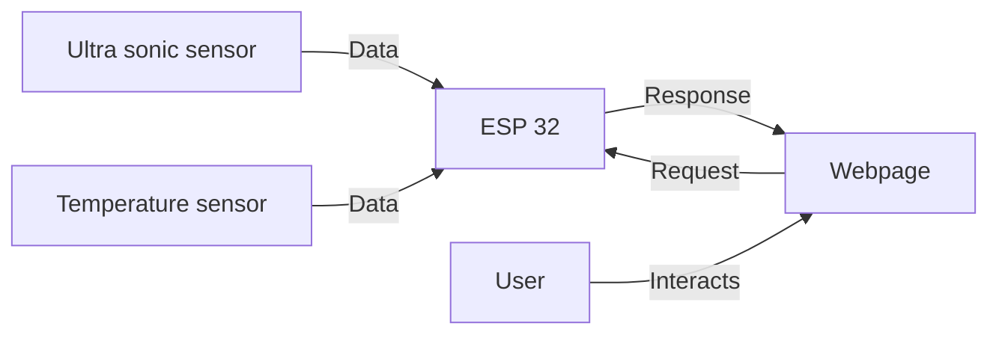
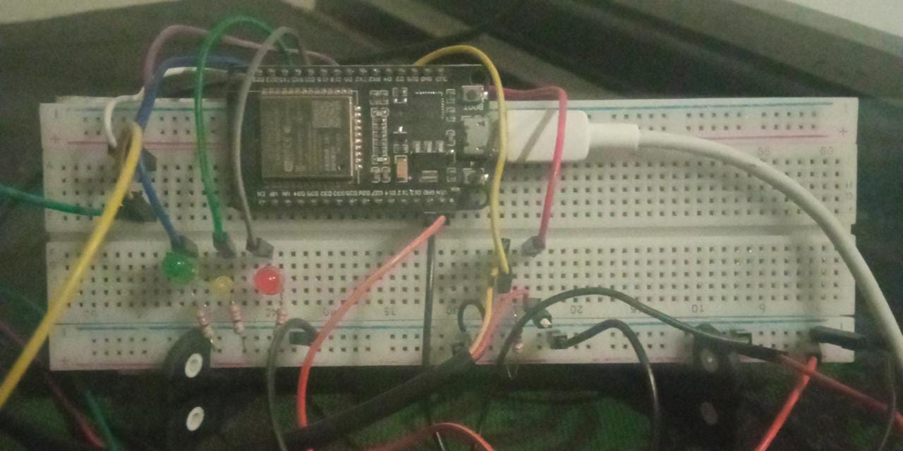
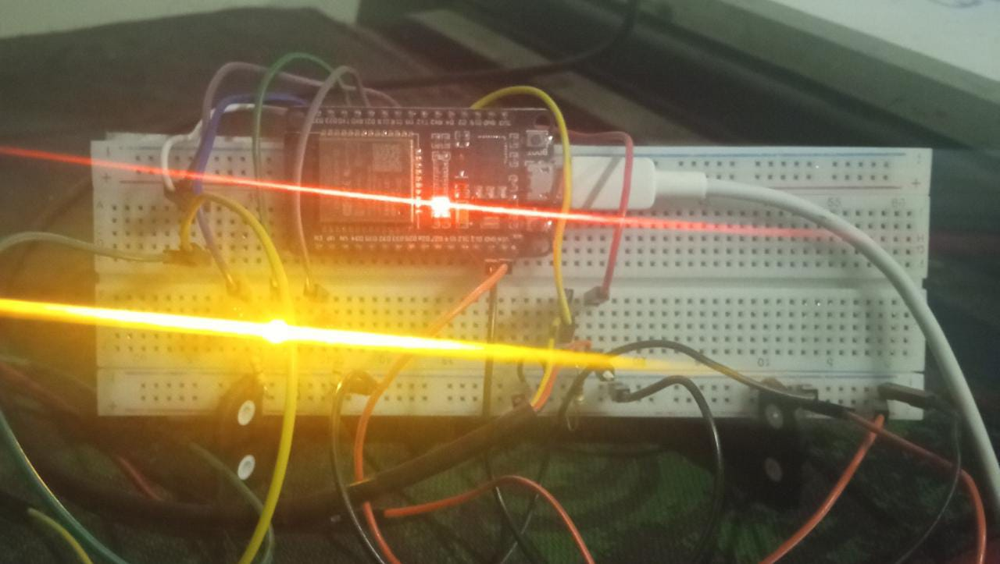
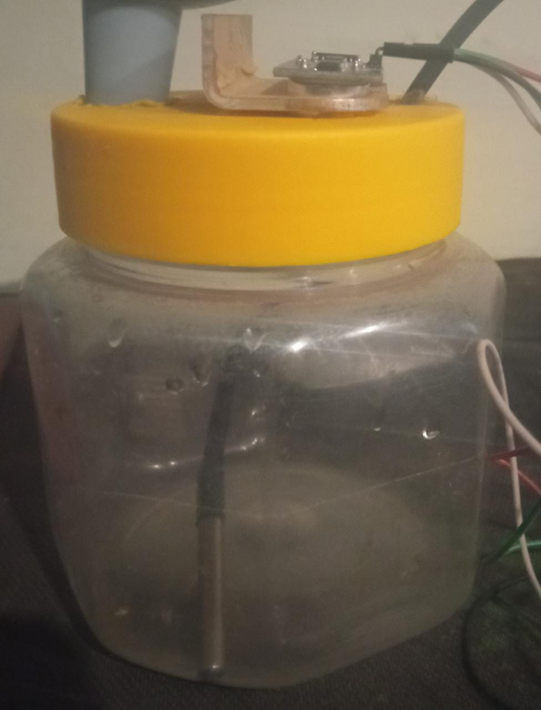
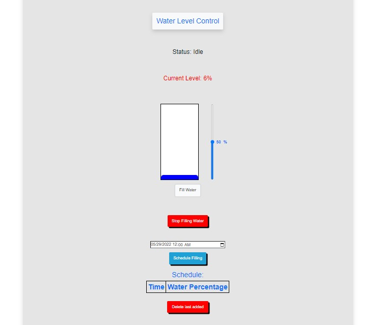
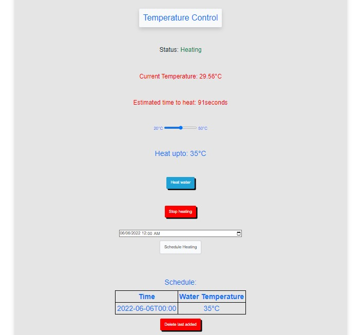
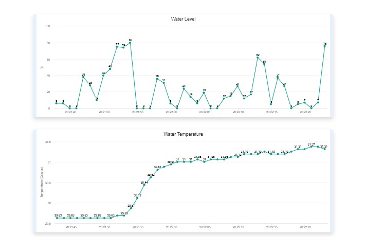

# Smart Water Tank

## Description
#### CMS: 341699

Water automation system  has two use cases
- Fill water in tank upto percentage specified by user
- Heat water to temperature specified by user

The system is controlled using the webpage which is served by the ESP 32 webserver.

## Animation

## Parts Used
Total Cost =  PKR 1700
- ESP 32 
- SR-04 Ultrasonic sensor 
- DS18B20 Temperature sensor  
- Bread board
- Leds
- Resistors
- Water Container
- USB data cable
- Jumper wires
## Interface
The user interface is implemented through a web server which is acessible through the localhost. The ESP 32 connects to the wifi using SSID and password predefined in a secret file. The user connects to the same wifi network to access the webpage.

## Features
- Fill water to a certain percentage
- Heat water to a certain temperature
- Visual indication of water level
- Visual indication of water temperature
- Temperature and water level readings in real time
- Temperature and water level graphs
- Scheduling of water filling and heating

## Status Leds
Onboard LEDs are present to reflect status.
|                |LED                          |State                         |
|----------------|-------------------------------|-----------------------------|
||Yellow Led             |WiFi is connected            |
|       |Green Led            |Water is being filled           |
|         |Red Led|Water is being heated|

## System design:

## Images

### Breadboard

### Container

### Water Filling Controls

### Water Heating Controls

### Graphs

